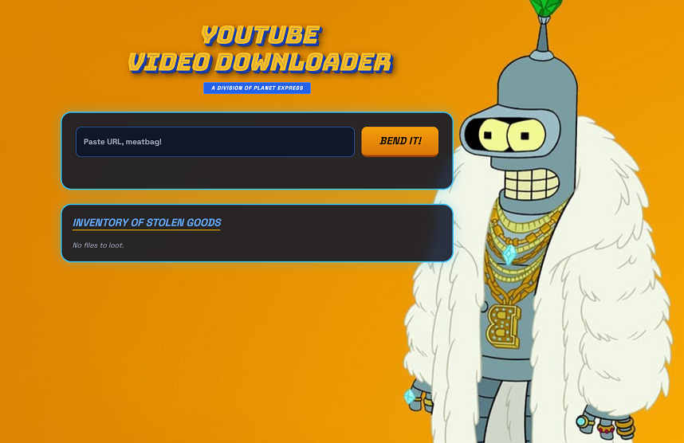

# YouTube Web Downloader - Planet Express Edition

Web interface for `yt-dlp`. Downloads YouTube videos to mp4.



## Installation & Setup

### 1. Prerequisites

Install `ffmpeg` on your server for video/audio merging:

```bash
sudo apt update && sudo apt install ffmpeg -y
```

### 2. File Preparation

Create the directory structure:

```bash
mkdir planet-express-downloader && cd planet-express-downloader
mkdir templates
```

Place `app.py` in the root, and `index.html` + `bender.jpg` in `templates/`.

### 3. Dependencies

Install the required Python packages:

```bash
pip install flask flask-socketio eventlet yt-dlp
```

## Usage

1. **Launch Server:** Run `python3 app.py`.
2. **Access UI:** Navigate to `http://<SERVER_IP>:5000`.
3. **Download:** Paste a URL and click "BEND IT!". Finished files appear in the "Inventory of Stolen Goods".

## Project Structure
```
.
├── app.py              # Backend & SocketIO Logic
├── templates/
│   ├── index.html      # Futurama Frontend
│   └── bender.jpg      # Background image
└── *.mp4               # Downloaded treasures
```
